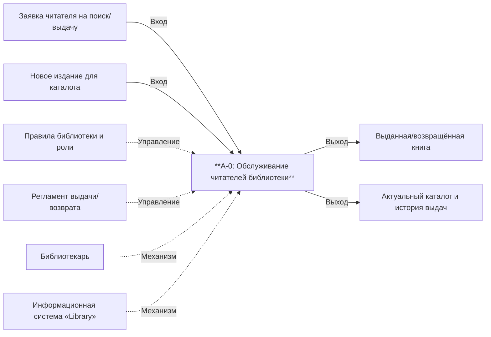
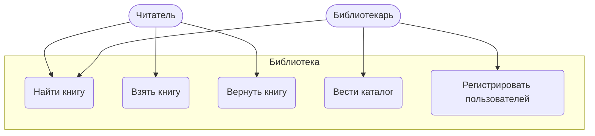
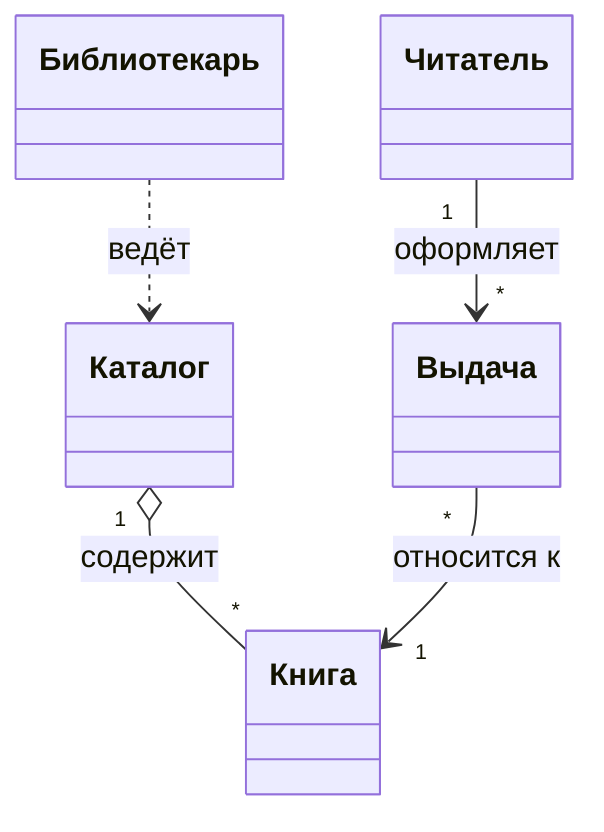

# Этап 0. Инициация и бизнес-анализ

## 1. Паспорт проекта (Executive Summary)

### Общая информация
- **Название проекта:** Электронная библиотека (Library)
- **Траектория:** Б — Веб-ориентированная
- **Автор:** Иванов Юрий Сергеевич, гр. ПИЖ-б-о-23-1
- **Дата начала:** 02.02.2026
- **Плановая дата завершения:** 07.06.2026

### Бизнес-контекст
- **Проблема:** Учёт фонда и обслуживание читателей ведутся вручную (журналы, картотека).
  Поиск книги занимает много времени, нет контроля, кто и когда взял издание, возможны
  ошибки и потери книг.
- **Решение:** Веб-приложение с электронным каталогом, полнотекстовым поиском по русскому
  тексту, ролевым доступом (читатель/библиотекарь) и учётом выдачи/возврата с привязкой к
  пользователю.

### Цели проекта
- Сократить время поиска и подбора книги читателем.
- Обеспечить достоверный учёт фонда и истории выдач.
- Разграничить права читателей и библиотекарей.
- Предоставить документированный REST API для интеграции.

### Ключевые показатели успеха (KPI)
| Показатель | Целевое значение |
|------------|------------------|
| Время полнотекстового поиска (p95) | < 300 мс |
| Точность учёта «кто держит книгу» | 100% (через таблицу выдач) |
| Покрытие бизнес-логики тестами | > 40% |
| Количество REST-эндпоинтов | ≥ 8 (реализовано 13) |

### Ключевые риски
| Риск | Стратегия реагирования |
|------|------------------------|
| Рассинхронизация каталога (Elasticsearch) и БД | Источник правды о выдачах — PostgreSQL; статус книги обновляется в одной операции сервиса |
| Утечка паролей | Хранение только BCrypt-хешей, сокрытие хеша в DTO ответов |
| Несанкционированный доступ к функциям библиотекаря | Централизованная проверка роли в перехватчике (`AuthInterceptor` + `@RequireRole`) |
| Высокая нагрузка на список книг | Пагинация (limit/offset) |

## 2. Диаграмма бизнес-контекста (IDEF0, A-0)

Контекстная диаграмма верхнего уровня: единственный процесс **«Обслуживание читателей библиотеки»**.

- **Входы (Input):** заявки читателей, новые издания.
- **Управление (Control):** правила библиотеки, роли, регламент выдачи.
- **Выходы (Output):** выданные/возвращённые книги, актуальный каталог, история выдач.
- **Механизмы (Mechanism):** библиотекарь, информационная система.

## 3. Диаграмма бизнес-прецедентов (BUC)

## 4. Бизнес-глоссарий (15+ терминов)

| Термин | Определение |
|--------|-------------|
| Библиотека | Учреждение, хранящее и выдающее книги читателям |
| Каталог | Совокупность всех изданий, доступных в библиотеке |
| Книга (издание) | Единица фонда: название, автор, ISBN, описание, жанр |
| ISBN | Международный стандартный книжный номер, уникальный идентификатор издания |
| Фонд | Все физические/электронные экземпляры книг библиотеки |
| Читатель | Пользователь, который ищет, берёт и возвращает книги |
| Библиотекарь | Сотрудник, ведущий каталог и регистрирующий пользователей |
| Роль | Набор прав пользователя в системе (USER / LIBRARIAN) |
| Выдача (loan) | Факт передачи книги читателю на руки |
| Возврат | Факт возвращения книги в фонд |
| Статус книги | Доступность издания: AVAILABLE / BORROWED |
| Полнотекстовый поиск | Поиск по содержимому полей с учётом морфологии языка |
| Морфология | Учёт словоформ (падежи, числа) при поиске |
| Релевантность | Степень соответствия результата поисковому запросу |
| Жанр | Категория книги (фантастика, детектив, программирование и т.д.) |
| Аутентификация | Проверка подлинности пользователя по email и паролю |
| Авторизация | Проверка прав пользователя на выполнение операции |
| Сессия | Серверное состояние авторизованного пользователя |

## 5. Модель бизнес-классов (высокоуровневая)

## 6. Матрица стейкхолдеров

| Стейкхолдер | Интерес | Влияние | Стратегия работы |
|-------------|---------|---------|------------------|
| Читатель | Быстро находить и брать книги | Среднее | Удобный поиск и UI |
| Библиотекарь | Контроль фонда и выдач | Высокое | Панель управления, учёт выдач |
| Администрация библиотеки | Сохранность фонда, отчётность | Высокое | Достоверный учёт, роли |
| Разработчик/сопровождение | Поддерживаемость системы | Среднее | Чистая архитектура, тесты, документация |

## 7. SWOT-анализ текущего процесса (до внедрения)

| | Положительное | Отрицательное |
|---|---------------|----------------|
| **Внутренние** | **Strengths:** знание фонда сотрудниками | **Weaknesses:** ручной учёт, медленный поиск, ошибки, нет истории выдач |
| **Внешние** | **Opportunities:** цифровизация, рост числа читателей | **Threats:** потеря/порча книг, зависимость от конкретного сотрудника |

**Вывод:** ручной процесс не масштабируется и не даёт контроля выдач — обоснована разработка
информационной системы.
