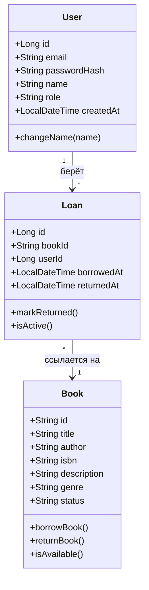

# Этап 1. Проектирование требований

## 1. Диаграмма вариантов использования (Use Case)

```mermaid
flowchart TB
    User([Читатель])
    Lib([Библиотекарь])

    subgraph Система «Library»
        UC1(Регистрация)
        UC2(Вход / выход)
        UC3(Просмотр каталога с пагинацией)
        UC4(Полнотекстовый поиск книг)
        UC5(Просмотр карточки книги)
        UC6(Взять книгу)
        UC7(Вернуть книгу)
        UC8(Добавить книгу)
        UC9(Удалить книгу по ISBN)
        UC10(Создать библиотекаря)
    end

    User --> UC1
    User --> UC2
    User --> UC3
    User --> UC4
    User --> UC5
    User --> UC6
    User --> UC7

    Lib --> UC2
    Lib --> UC3
    Lib --> UC4
    Lib --> UC5
    Lib --> UC8
    Lib --> UC9
    Lib --> UC10
```

Библиотекарь обладает всеми правами читателя плюс операции управления каталогом и
пользователями (UC8–UC10).

## 2. Доменная модель (Domain Model)



Хранилища:
- `User`, `Loan` — реляционная БД **PostgreSQL** (JPA);
- `Book` — поисковый движок **Elasticsearch** (документ);
- связь `Loan.bookId → Book.id` логическая (между разными хранилищами), целостность
  обеспечивается бизнес-логикой сервисного слоя.

## 3. Спецификация прецедентов

### UC6. Взять книгу

| Поле | Значение |
|------|----------|
| **Актор** | Читатель (авторизованный) |
| **Предусловие** | Пользователь вошёл в систему; книга существует и имеет статус `AVAILABLE` |
| **Основной сценарий** | 1. Читатель открывает карточку книги.<br>2. Нажимает «Взять читать».<br>3. Система проверяет, что нет активной выдачи по книге.<br>4. Система меняет статус книги на `BORROWED`.<br>5. Система создаёт запись `Loan` (book_id, user_id, borrowed_at).<br>6. Система отображает обновлённый статус. |
| **Альтернативы** | 3а. Книга уже выдана → ошибка 409 «Книга уже выдана». |
| **Постусловие** | Книга числится за читателем; в `loans` появилась активная запись |

### UC7. Вернуть книгу

| Поле | Значение |
|------|----------|
| **Актор** | Читатель, оформивший выдачу |
| **Предусловие** | По книге есть активная выдача, оформленная этим читателем |
| **Основной сценарий** | 1. Читатель открывает карточку выданной книги.<br>2. Нажимает «Вернуть книгу».<br>3. Система находит активную выдачу.<br>4. Проверяет, что выдачу оформил текущий пользователь.<br>5. Помечает выдачу возвращённой (`returned_at`).<br>6. Меняет статус книги на `AVAILABLE`. |
| **Альтернативы** | 4а. Книгу пытается вернуть другой пользователь → ошибка 403.<br>3а. Активной выдачи нет → ошибка 404. |
| **Постусловие** | Книга доступна; выдача закрыта |

### UC4. Полнотекстовый поиск книг

| Поле | Значение |
|------|----------|
| **Актор** | Авторизованный пользователь |
| **Предусловие** | Пользователь вошёл в систему |
| **Основной сценарий** | 1. Пользователь вводит запрос.<br>2. Система выполняет поиск по полям *title, description, author, genre* (нечётко) и *isbn* (точно).<br>3. Возвращает релевантные результаты постранично (limit/offset). |
| **Альтернативы** | 2а. Пустой запрос → возвращается пустая страница. |
| **Постусловие** | Отображён список найденных книг с пагинацией |

## 4. Глоссарий системных терминов (20+)

| Термин | Определение |
|--------|-------------|
| Актор | Внешняя сущность, взаимодействующая с системой |
| Прецедент (Use Case) | Сценарий взаимодействия актора с системой |
| Сущность (Entity) | Бизнес-объект предметной области |
| DTO | Объект передачи данных между слоями/по сети |
| Эндпоинт | URL+метод REST API |
| Сессия | Серверное состояние авторизации |
| Роль | USER или LIBRARIAN |
| Аутентификация | Проверка email+пароль |
| Авторизация | Проверка прав на операцию |
| BCrypt | Алгоритм хеширования паролей |
| Индекс (ES) | Структура хранения документов в Elasticsearch |
| Анализатор | Цепочка обработки текста (токенизация, стемминг) |
| Стеммер | Приведение слова к основе |
| multi_match | Запрос ES по нескольким полям |
| fuzziness | Допуск опечаток (расстояние редактирования) |
| Пагинация | Постраничная выдача (limit/offset) |
| Статус книги | AVAILABLE / BORROWED |
| Выдача (Loan) | Запись о книге на руках у пользователя |
| Активная выдача | Выдача с `returned_at = null` |
| Репозиторий | Объект доступа к хранилищу (Spring Data) |
| Перехватчик (Interceptor) | Компонент проверки запроса до контроллера |
| Валидация | Проверка корректности входных данных |
| Пагинированный ответ | `{ content, total, offset, limit }` |

## 5. Таблица трассировки (бизнес → системные требования)

| Бизнес-требование (Этап 0) | Системное требование | Прецедент | Реализация |
|----------------------------|----------------------|-----------|------------|
| Быстрый поиск книги | Полнотекстовый поиск по всем полям | UC4 | `BookController.search`, ES multi_match |
| Учёт «кто держит книгу» | Выдача с привязкой к пользователю | UC6, UC7 | `LoanService`, таблица `loans` |
| Разграничение прав | Роли USER/LIBRARIAN | UC8–UC10 | `AuthInterceptor`, `@RequireRole` |
| Ведение каталога | CRUD книг | UC8, UC9 | `BookController.create/deleteByIsbn` |
| Регистрация пользователей | Регистрация и создание библиотекаря | UC1, UC10 | `UserController` |
| Сохранность паролей | Хеширование, сокрытие хеша | — | BCrypt, `UserResponse` |
| Масштабируемый список | Пагинация | UC3 | limit/offset, `PageResponse` |
