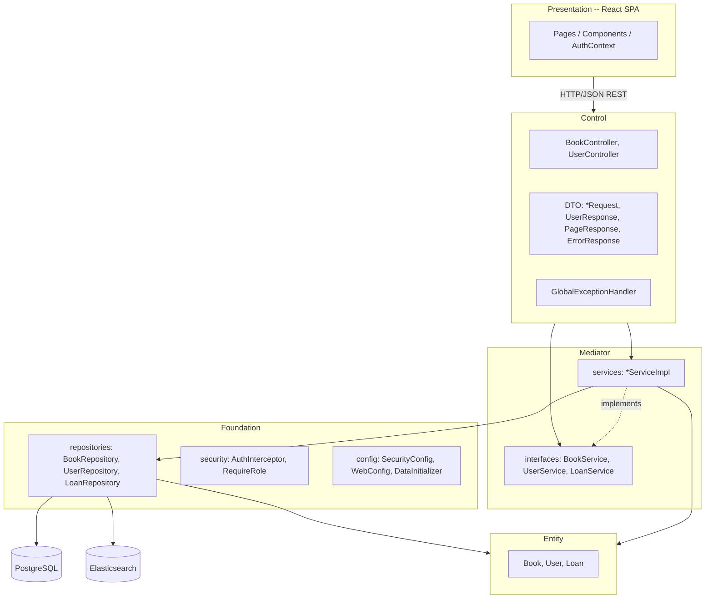

# Этап 2. Архитектурное проектирование (PCMEF)

## 1. Обоснование выбора PCMEF

Система построена по слоистому паттерну **PCMEF** (Presentation · Control · Mediator · Entity ·
Foundation). Зависимости направлены строго сверху вниз, что обеспечивает изоляцию слоёв,
тестируемость бизнес-логики и отсутствие циклов.

Отображение слоёв на пакеты проекта:

| Слой PCMEF | Где находится | Содержимое |
|------------|---------------|------------|
| **P** — Presentation | `library-frontend/` (React SPA) | Страницы, компоненты, маршрутизация, состояние |
| **C** — Control | `ru.edu.project.control` | REST-контроллеры, DTO запросов/ответов, обработка ошибок |
| **M** — Mediator | `ru.edu.project.mediator` | Интерфейсы и реализации сервисов (бизнес-логика, транзакции) |
| **E** — Entity | `ru.edu.project.entity` | Доменные сущности `Book`, `User`, `Loan` с бизнес-методами |
| **F** — Foundation | `ru.edu.project.foundation` | Репозитории доступа к данным, конфигурация, безопасность |

## 2. Диаграмма пакетов PCMEF

**Правило зависимостей:** P → C → M → E → F. Вышележащие слои зависят от нижележащих, обратные
зависимости отсутствуют.

## 3. Ответственность слоёв

| Слой | Отвечает за | НЕ должен |
|------|-------------|-----------|
| Presentation | Отрисовку, ввод, навигацию | Содержать бизнес-логику |
| Control | Маршрутизацию, валидацию DTO, коды ответов | Обращаться к БД напрямую |
| Mediator | Бизнес-правила, транзакции, координацию | Знать о Presentation |
| Entity | Состояние и бизнес-методы (`borrowBook`, `markReturned`) | Содержать доступ к данным |
| Foundation | Доступ к данным, инфраструктуру | Содержать бизнес-правила |

Не-анемичные сущности: инварианты живут в самих сущностях — например, `Book.borrowBook()`
бросает исключение, если книга уже выдана; `Loan.markReturned()` запрещает повторный возврат.

## 4. Контроль качества архитектуры

| Принцип | Проверка | Статус |
|---------|----------|--------|
| Строгая иерархия слоёв | Диаграмма пакетов, импорты | ✅ |
| Изоляция слоёв | Код-ревью | ✅ |
| Коммуникация через интерфейсы | `BookService`/`UserService`/`LoanService` + интерфейсы репозиториев Spring Data | ✅ |
| Отсутствие циклов | Зависимости только «вниз» | ✅ |
| Кросс-каттинг (auth, errors) | Вынесены в `AuthInterceptor` и `GlobalExceptionHandler` | ✅ |

## 5. Архитектурные решения (ADR)

- [ADR-001: Elasticsearch для поиска книг, PostgreSQL для пользователей](adr/ADR-001-storage-choice.md)
- [ADR-002: Сессионная аутентификация и перехватчик вместо полного Spring Security](adr/ADR-002-auth-approach.md)
- [ADR-003: Учёт выдач в отдельной таблице PostgreSQL](adr/ADR-003-loan-tracking.md)

## 6. Интерфейсы между слоями

См. [interfaces/interfaces.md](interfaces/interfaces.md).
