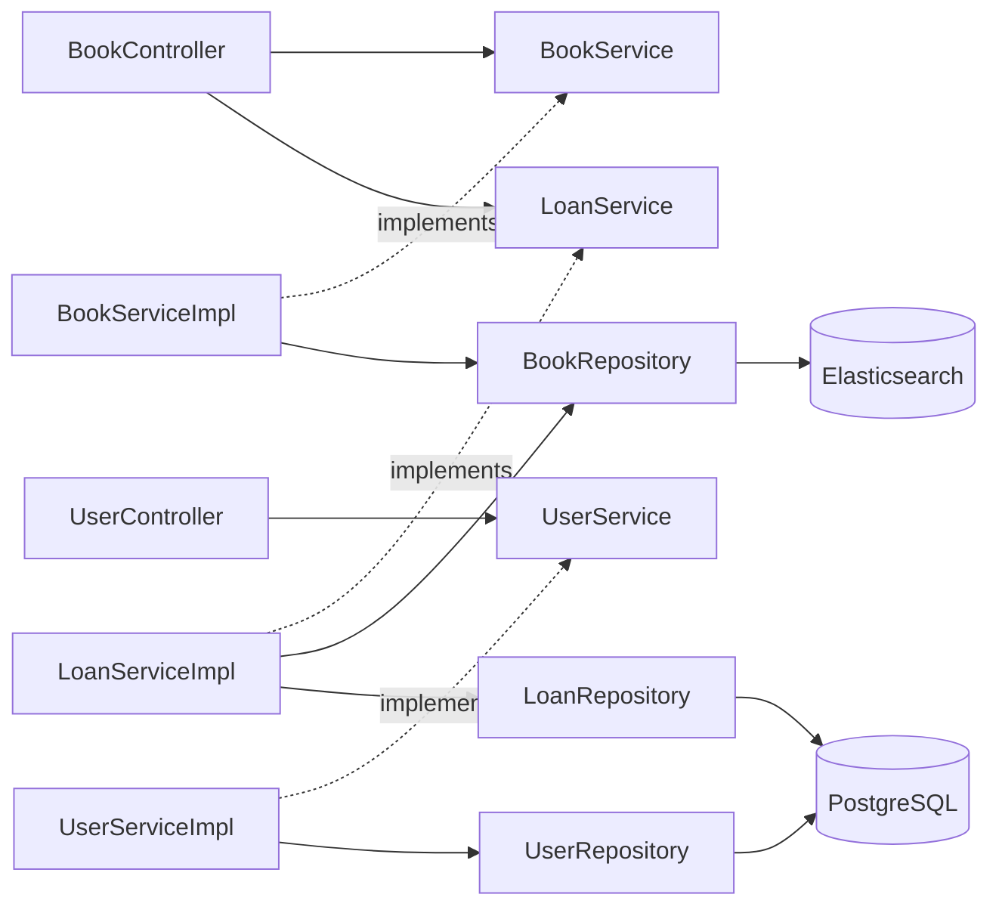

# Спецификация интерфейсов между слоями

Слои общаются через интерфейсы. Control зависит от интерфейсов сервисов (Mediator), Mediator — от
интерфейсов репозиториев (Foundation, Spring Data).

## Control → Mediator (сервисы)

```java
public interface BookService {
    Book addBook(String title, String author, String isbn, String description, String genre);
    Page<Book> getBooks(Pageable pageable);
    Optional<Book> getBookById(String id);
    Page<Book> searchBooks(String query, Pageable pageable);
    void deleteBook(String id);
    void deleteByIsbn(String isbn);
}

public interface UserService {
    User registerUser(String email, String password, String name);
    User registerLibrarian(String email, String password, String name);
    Optional<User> authenticate(String email, String rawPassword);
    Optional<User> getUserByEmail(String email);
    Optional<User> getUserById(Long id);
    User updateUserName(Long id, String newName);
}

public interface LoanService {
    Loan borrowBook(String bookId, Long userId);
    Loan returnBook(String bookId, Long userId);
}
```

## Mediator → Foundation (репозитории, Spring Data)

```java
// Elasticsearch
public interface BookRepository extends ElasticsearchRepository<Book, String> {
    Optional<Book> findByIsbn(String isbn);
    @Query(/* bool: multi_match(title,description,author,genre, fuzziness AUTO) + term(isbn) */)
    Page<Book> searchByQuery(String query, Pageable pageable);
}

// PostgreSQL (JPA)
public interface UserRepository extends JpaRepository<User, Long> {
    Optional<User> findByEmail(String email);
}

public interface LoanRepository extends JpaRepository<Loan, Long> {
    Optional<Loan> findByBookIdAndReturnedAtIsNull(String bookId);
    List<Loan> findByUserIdAndReturnedAtIsNull(Long userId);
}
```

## Диаграмма зависимостей



Граф ацикличен — циклических зависимостей между слоями нет.
