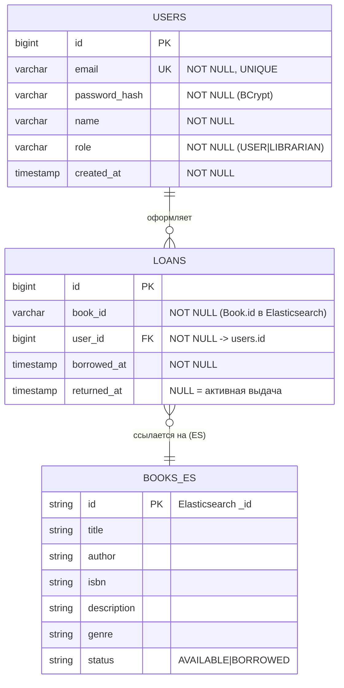

# Этап 3. Проектирование базы данных

## 1. Состав хранилищ

| Данные | Хранилище | Обоснование |
|--------|-----------|-------------|
| Пользователи (`users`) | PostgreSQL | Транзакции, уникальность email, связи |
| Выдачи (`loans`) | PostgreSQL | Связь с пользователем, история, целостность |
| Книги (`books`) | Elasticsearch | Полнотекстовый поиск с морфологией (см. ADR-001) |

Реляционная схема (PostgreSQL) нормализована до **3НФ**. Книга хранится как документ
Elasticsearch, поэтому в ER-модели представлена как внешняя сущность, на которую логически
ссылается `loans.book_id`.

## 2. ER-диаграмма (логическая модель)



## 3. DDL-скрипты

Полный скрипт: [schema.sql](schema.sql). Основное:

```sql
CREATE TABLE users (
    id            BIGSERIAL    PRIMARY KEY,
    email         VARCHAR(255) NOT NULL UNIQUE,
    password_hash VARCHAR(255) NOT NULL,
    name          VARCHAR(255) NOT NULL,
    role          VARCHAR(32)  NOT NULL DEFAULT 'USER'
                  CHECK (role IN ('USER', 'LIBRARIAN')),
    created_at    TIMESTAMP    NOT NULL DEFAULT now()
);

CREATE TABLE loans (
    id          BIGSERIAL    PRIMARY KEY,
    book_id     VARCHAR(255) NOT NULL,
    user_id     BIGINT       NOT NULL REFERENCES users(id),
    borrowed_at TIMESTAMP    NOT NULL DEFAULT now(),
    returned_at TIMESTAMP
);

-- Быстрый поиск активной выдачи по книге и книг на руках у пользователя
CREATE INDEX idx_loans_book_active ON loans(book_id) WHERE returned_at IS NULL;
CREATE INDEX idx_loans_user_active ON loans(user_id) WHERE returned_at IS NULL;
```

> Таблицы создаются автоматически Hibernate (`spring.jpa.hibernate.ddl-auto=update`).
> Скрипт `schema.sql` приведён как эталонная физическая модель и для ручного развёртывания.

## 4. Индекс Elasticsearch `books`

Маппинг задаётся аннотациями `@Field` сущности `Book` и настройками `es-config.json`:
- `title`, `description`, `author`, `genre` — `text`, анализатор `russian_analyzer`
  (lowercase + русские стоп-слова + стеммер) → полнотекстовый поиск с морфологией;
- `isbn`, `status` — `keyword` (точное совпадение).

## 5. Стратегия ORM (маппинг Entity → таблицы)

| Сущность | Аннотации | Таблица/индекс |
|----------|-----------|----------------|
| `User` | `@Entity @Table("users")`, `@Id @GeneratedValue(IDENTITY)`, `@Column(unique,nullable)` | `users` |
| `Loan` | `@Entity @Table("loans")`, `@Id @GeneratedValue(IDENTITY)` | `loans` |
| `Book` | `@Document(indexName="books")`, `@Field(...)`, `@Setting` | индекс `books` (ES) |

- Маппинг реализует паттерн **Data Mapper** (Spring Data репозитории).
- Уникальность объектов в рамках сессии обеспечивает контекст персистентности Hibernate
  (**Identity Map**). Подробнее — в [docs/07-refactoring](../07-refactoring/refactoring.md).
