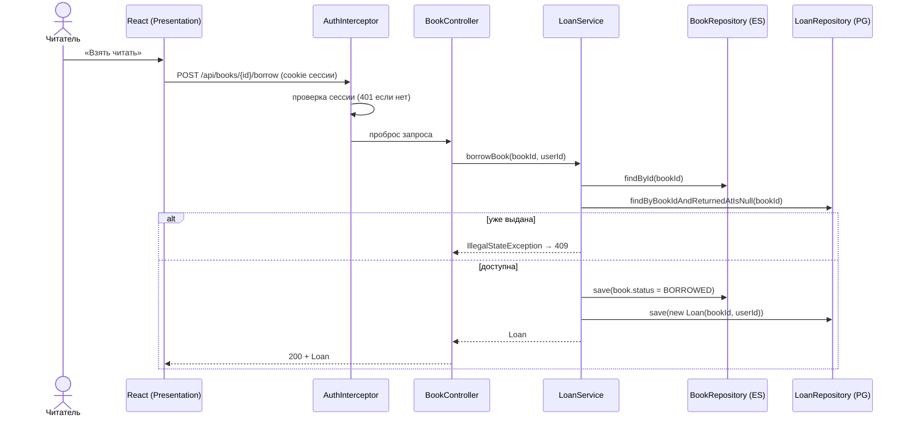
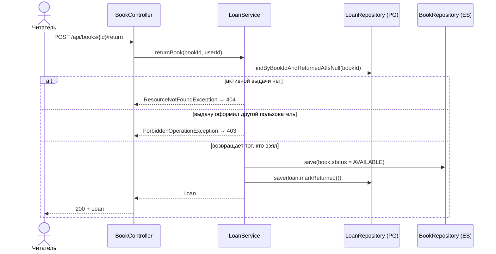
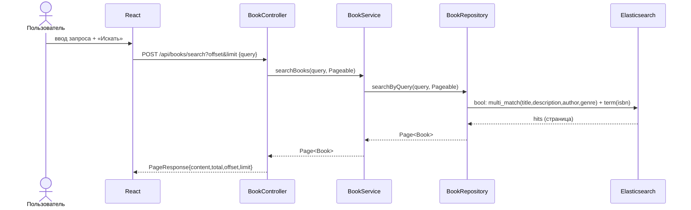
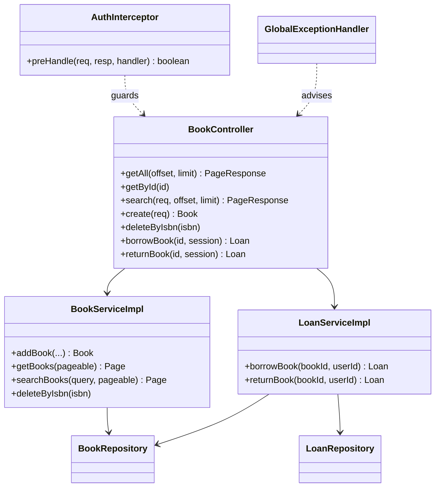

# Этап 4. Детальное проектирование

## 1. Диаграммы последовательности

### 1.1. Выдача книги (UC6)

### 1.2. Возврат книги (UC7) — защита «чужого» возврата

### 1.3. Полнотекстовый поиск (UC4)

## 2. Диаграмма классов проектирования

## 3. Спецификация ключевых методов

| Метод | Сигнатура | Контракт |
|-------|-----------|----------|
| Выдача | `Loan LoanService.borrowBook(String bookId, Long userId)` | Книга существует и доступна → создаёт выдачу, статус `BORROWED`. Иначе 404/409. |
| Возврат | `Loan LoanService.returnBook(String bookId, Long userId)` | Есть активная выдача этого пользователя → закрывает её, статус `AVAILABLE`. Иначе 404/403. |
| Поиск | `Page<Book> BookService.searchBooks(String query, Pageable p)` | Пустой запрос → пустая страница; иначе нечёткий поиск по 4 полям + точный по ISBN. |
| Аутентификация | `Optional<User> UserService.authenticate(String email, String raw)` | Возвращает пользователя при совпадении BCrypt-хеша, иначе `empty`. |
| Удаление по ISBN | `void BookService.deleteByIsbn(String isbn)` | Найдена книга по ISBN → удаление; иначе 404. |

## 4. Применённые паттерны проектирования

| Паттерн | Где |
|---------|-----|
| Data Mapper | Spring Data репозитории (Entity ↔ хранилище) |
| Identity Map | Контекст персистентности Hibernate |
| Dependency Injection | Конструкторное внедрение Spring |
| Strategy | `PasswordEncoder` (BCrypt) как сменная стратегия хеширования |
| Interceptor / Filter | `AuthInterceptor` (кросс-каттинг авторизация) |
| DTO | `*Request`, `UserResponse`, `PageResponse`, `ErrorResponse` |
