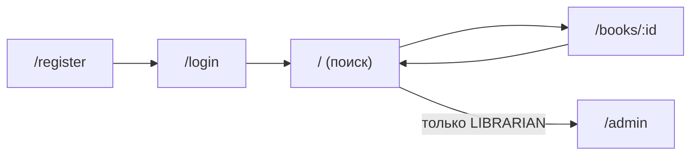

# Этап 8. Пользовательский интерфейс (Web)

Клиент — одностраничное приложение (SPA) на React + Vite. Слой Presentation отделён от сервера и
взаимодействует с ним по REST (Axios, cookie сессии).

## 1. Экраны (5+)

| # | Экран | Маршрут | Назначение | Доступ |
|---|-------|---------|------------|--------|
| 1 | Вход | `/login` | Аутентификация | Все |
| 2 | Регистрация | `/register` | Создание читателя | Все |
| 3 | Поиск/каталог | `/` | Список с пагинацией + полнотекстовый поиск | Авторизованные |
| 4 | Карточка книги | `/books/:id` | Детали, «Взять»/«Вернуть» | Авторизованные |
| 5 | Панель библиотекаря | `/admin` | Добавить книгу · удалить по ISBN · создать библиотекаря | LIBRARIAN |

## 2. Навигация

Маршруты защищены по роли: неавторизованный перенаправляется на `/login`, не-библиотекарь не
видит вход в `/admin`.

## 3. Особенности реализации

- **Состояние авторизации** — `AuthContext` (`useAuth`): реактивно, без перезагрузки страницы.
- **Валидация на клиенте** — `react-hook-form` (обязательные поля, формат email, длина пароля ≥ 6).
- **Динамическое обновление** — запросы через Axios без перезагрузки (поиск, выдача, возврат).
- **Пагинация** — кнопки «Назад/Вперёд» + «Страница N из M (всего K)».
- **Адаптивность/UX** — общие стили `styles/ui.js`, сообщения об ошибках/успехе вместо `alert`.

## 4. Скриншоты

