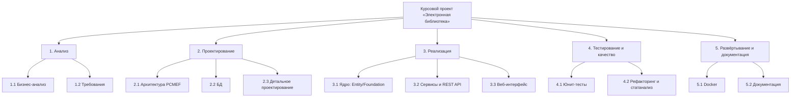
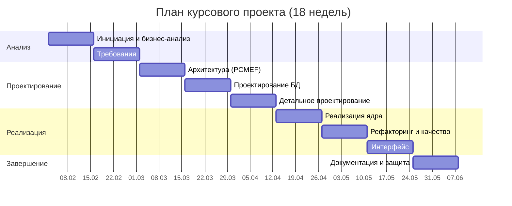

# Этап 12. Пояснительная записка (структура и управление проектом)

Пояснительная записка собирается из материалов этапов 0–11. Ниже — содержание с указанием
источников, а также артефакты управления проектом (WBS, Гантт, COCOMO).

## Содержание пояснительной записки

```
ВВЕДЕНИЕ ......................................... README, docs/00
1. АНАЛИТИЧЕСКАЯ ЧАСТЬ ............................ docs/00-project-charter
   1.1 Описание предметной области
   1.2 Бизнес-процессы (IDEF0 A-0)
   1.3 SWOT-анализ
   1.4 Стейкхолдеры, бизнес-глоссарий
2. ПРОЕКТНАЯ ЧАСТЬ
   2.1 Требования (Use Case, спецификации) ....... docs/01-requirements
   2.2 Модель предметной области (Domain Model) .. docs/01-requirements
   2.3 Архитектура (PCMEF, ADR, интерфейсы) ...... docs/02-architecture
   2.4 База данных (ER, DDL, ORM) ................ docs/03-database
   2.5 Детальное проектирование (sequence/class) . docs/04-detailed-design
3. РЕАЛИЗАЦИОННАЯ ЧАСТЬ
   3.1 Реализация ядра .......................... docs/05-implementation
   3.2 Рефакторинг (Data Mapper, Identity Map) ... docs/07-refactoring
   3.3 Пользовательский интерфейс ............... docs/08-ui
   3.4 Безопасность и транзакции ................ docs/02 (ADR-002), docs/07
   3.5 REST API (OpenAPI) ....................... docs/09-api
4. ТЕСТИРОВАНИЕ И КАЧЕСТВО ........................ docs/06-testing
5. РАЗВЁРТЫВАНИЕ И ЭКСПЛУАТАЦИЯ ................... docs/10-deployment, docs/11-user-guide
6. УПРАВЛЕНИЕ ПРОЕКТОМ ............................ настоящий документ
ЗАКЛЮЧЕНИЕ
СПИСОК ИСТОЧНИКОВ
ПРИЛОЖЕНИЯ (листинги, скриншоты, результаты тестов)
```

## 1. WBS (иерархическая структура работ)



## 2. Календарный план (диаграмма Ганта)



## 3. Оценка трудозатрат (COCOMO, базовая)

Органический тип проекта (organic): `PM = 2.4 × (KLOC)^1.05`, `TDEV = 2.5 × (PM)^0.38`.

При ориентировочном объёме **3 KLOC** (веб-траектория):
- Усилия: `PM = 2.4 × 3^1.05 ≈ 7.6` человеко-месяцев (промышленная оценка для команды);
- Для учебного проекта (один исполнитель, ~100 часов по методичке) трудозатраты соответствуют
  ориентиру траектории Б (~100 часов / семестр).

> COCOMO здесь приведён как иллюстрация метода; реальные затраты учебного проекта измеряются
> в часах и укладываются в норматив траектории.

## 4. Управление рисками

| Риск | Вероятность | Влияние | Реагирование |
|------|-------------|---------|--------------|
| Рассинхронизация ES и PostgreSQL | Средняя | Среднее | Источник правды о выдачах — PostgreSQL; обновление в одном сервисном методе |
| Утечка паролей | Низкая | Высокое | BCrypt + сокрытие хеша в DTO |
| Несанкционированный доступ | Средняя | Высокое | Перехватчик + роли |
| Срыв сроков | Средняя | Среднее | Поэтапный план, Git-история |

## 5. Заключение

Реализовано веб-приложение «Электронная библиотека» по архитектуре PCMEF: каталог с
полнотекстовым поиском (Elasticsearch), учёт пользователей и выдач (PostgreSQL), ролевая
безопасность (BCrypt, сессии, перехватчик), REST API (13 эндпоинтов, OpenAPI), модульные тесты и
контейнеризация. Проект закрывает обязательное ядро и требования веб-траектории. Перспективы
развития: переход на JWT, статанализ SonarQube, интеграционные тесты на Testcontainers, отчёты по
выдачам.

## Список использованных источников
1. Мацяшек Л. Практическая программная инженерия на основе учебного примера. — М.: Вильямс, 2021.
2. Соммервилл И. Инженерия программного обеспечения. 10-е изд. — М.: Вильямс, 2018.
3. Мартин Р. Чистая архитектура. — СПб.: Питер, 2018.
4. Фаулер М. Шаблоны корпоративных приложений. — М.: Вильямс, 2016.
5. Документация Spring Boot, Spring Data Elasticsearch, Elasticsearch 8.11.
